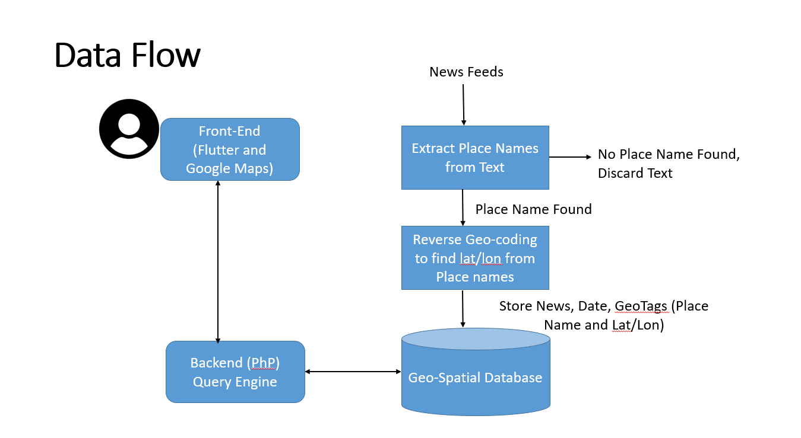
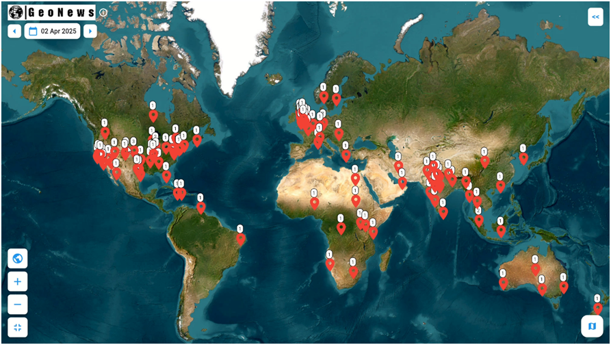
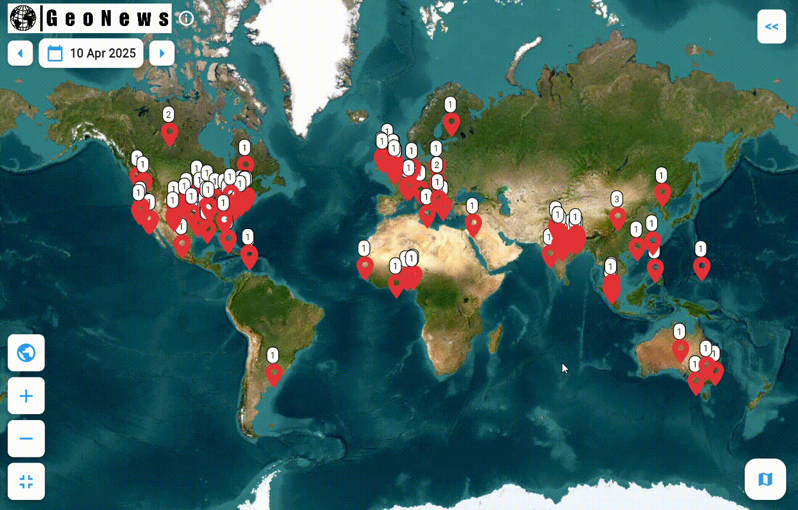
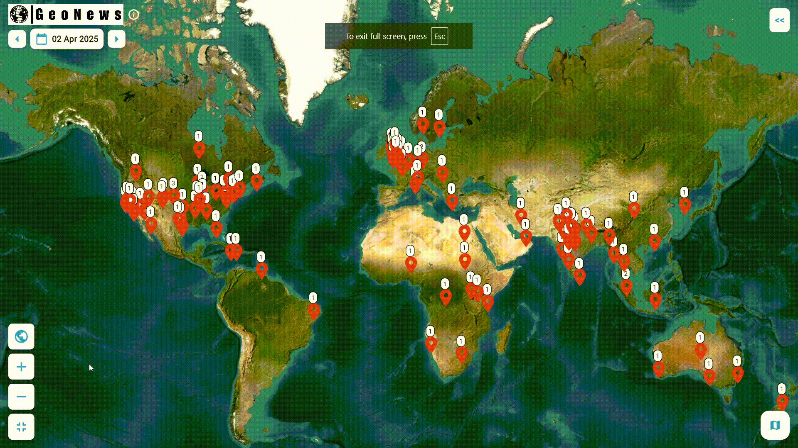
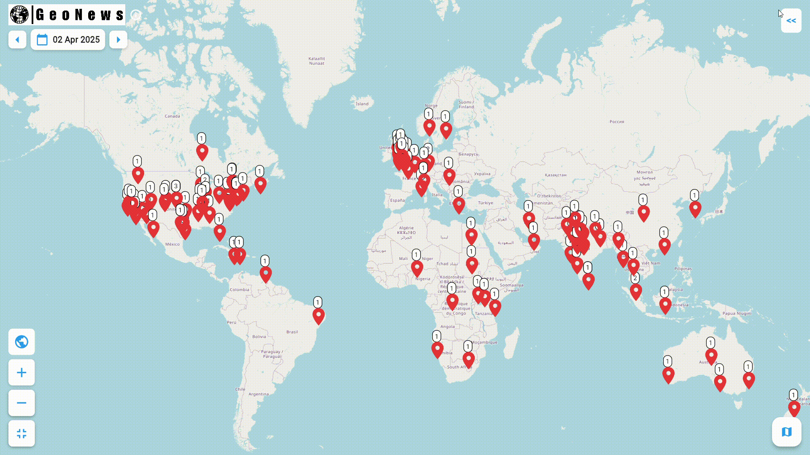
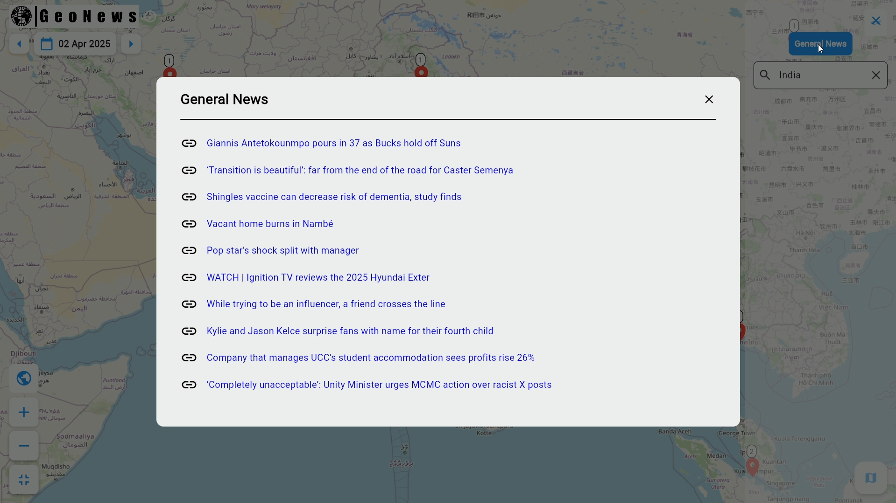

# GeoNews: Location-Based News Aggregator

GeoNews is a location-aware news platform that combines real-time news aggregation, NLP-based geographic tagging, and interactive map-based visualization to deliver a dynamic and contextually relevant news experience.

---

## Overview

In the digital era, accessing real-time and contextually relevant news remains a challenge due to the overwhelming volume of online information. Traditional news aggregators often lack geospatial intelligence, making it difficult to explore location-specific news dynamically.

GeoNews bridges this gap by:
- Aggregating real-time news via APIs like Newsdata.io
- Extracting geographic entities using spaCy NLP (NER)
- Mapping articles with OpenCage Geocoder
- Visualizing news on a Flutter-based OpenStreetMap UI

Users can:
- View news by country and date
- Interact with map markers for location-specific updates
- Explore both tagged (with locations) and untagged (general) news

---

## Features

- Real-time News Aggregation from multiple APIs
- Named Entity Recognition (NER) to extract GPE/LOC from news
- Location Geocoding using OpenCage API
- Disambiguation for duplicate place names
- Interactive Map (OpenStreetMap, Esri Imagery, TopoMap, Terrain)
- Filter by Date and Country
- View News Pop-Ups directly from the map
- PostgreSQL backend for structured storage
- Separate storage of untagged articles

---

## Data Flow Diagram

The data flow diagram below illustrates the interaction between the key components of GeoNews:

---

## User Interface Visuals

### Home Page 

### Filter By Date 

### View Detailed News Summary of Pointers

### Filter By Country 

### General News 
#### Any News for which we could not find a location, are stored under General News

### Map Styles

---

## System Architecture

### Technologies Used
- Frontend: Flutter (Cross-platform)
- Backend: PHP
- Database: PostgreSQL
- NLP: spaCy `en_core_web_lg`
- Geocoding: OpenCage Geocoder API
- News Sources: Newsdata.io API

---

